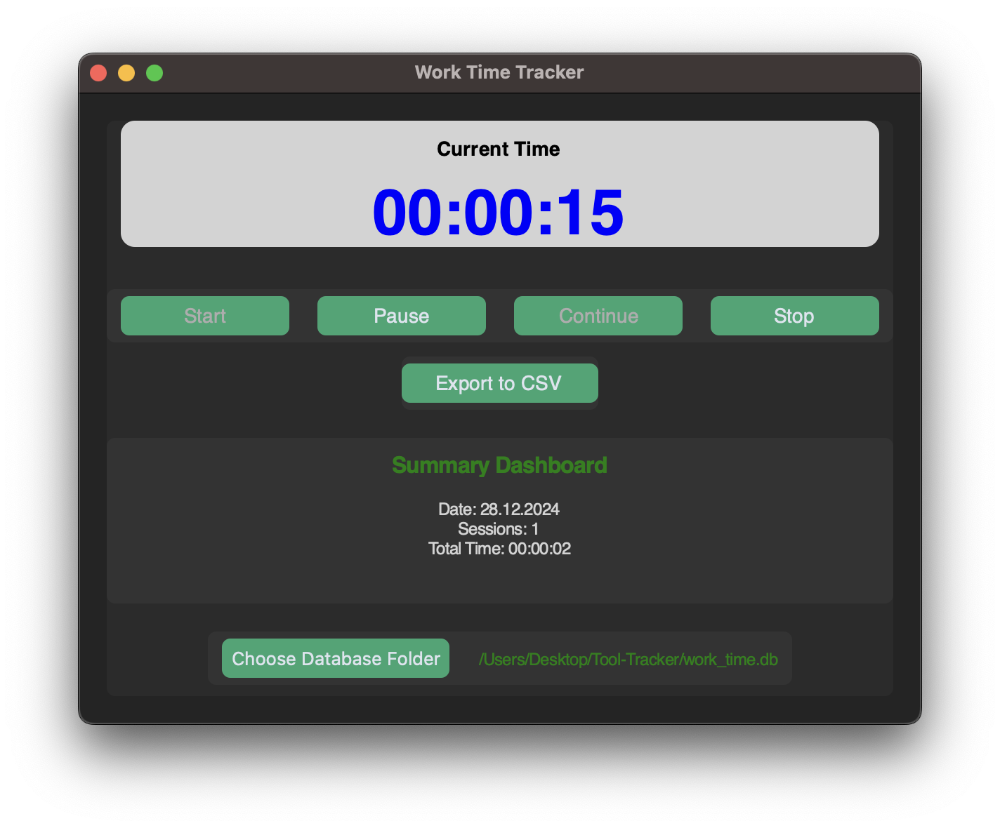

# README Time-Tracker

## Table of Contents

1. [Motivation](#1-motivation)
2. [Installation](#2-installation)
3. [Usage](#3-usage)
4. [Code](#4-code)
5. [Features](#5-features)  
6. [Troubleshooting](#6-troubleshooting)  
7. [Contributing](#7-contributing)  
8. [License](#8-license)  
9. [Version](#9-version)

<br><hr>

## 1. Motivation

The **Time Tracker** tool was developed to quickly and efficiently record work hours independently. As part of my bachelor's thesis, I wanted to track my own working hours and created this small tool. It allows users to:  
- Start tracking time.  
- Take breaks and resume work after breaks.  
- Finish the day and save the session in a database.  
- Export the work data for further analysis.  
- Get reminders to take breaks during long sessions.

<br><hr>

## 2. Installation

### Prerequisites
- **Git**: Ensure Git is installed and added to your system's PATH. You can download it from [Git](https://git-scm.com).
- **Python**: Install Python 3.8 or higher. [Download Python](https://www.python.org).

### Steps
1. **Clone this repository**:  
```bash
git clone https://github.com/beri336/Time-Tracker
```

2. **Navigate to the directory**:  
```bash
cd Time-Tracker
```

3. **Install dependencies**:  
```bash
pip install customtkinter tkinter
```  

Alternatively, use `requirements.txt`:  
```bash
pip install -r requirements.txt
```

<br><hr>

## 3. Usage

1. **Run the application**:
```bash
python app.py
```

- The GUI will open and look like this:


<br>

> Label
- **`Current-Time Label`**: Displays the current running time.  
- **`Path`**: Displays the current path where the database is stored.  
- **`Summary Dashboard`**: Shows daily summaries, including total worked hours and session counts.

<br>

> Buttons
- **`Start`**: Starts the timer.  
- **`Pause`**: Pauses the timer.  
- **`Continue`**: Resumes the paused timer.  
- **`Stop`**: Stops the timer and saves the session in the database.  
- **`Choose Database Folder`**: Allows the user to select the folder where the database will be stored. If it doesn't exist, it will be created.  
- **`Export to CSV`**: Exports the database contents to a CSV file for further analysis.

<br>

### 3. Example:



<br><hr>

## 4. Code

### Functions Overview


| Function                  | Description                                                                 |
|---------------------------|-----------------------------------------------------------------------------|
| **`init_database`**       | Initializes the database structure and folder.                             |
| **`start_timer`**         | Starts the timer and records the session's start time.                     |
| **`pause_timer`**         | Pauses the timer and retains the elapsed time for resumption.              |
| **`continue_timer`**      | Resumes the paused timer.                                                  |
| **`stop_timer`**          | Stops the timer, saves the session data to the database, and resets it.    |
| **`reset_timer`**         | Resets the timer and elapsed time to the initial state.                    |
| **`update_clock`**        | Updates the GUI clock display in real-time.                                |
| **`send_reminder`**       | Sends a popup notification reminding the user to take a break.             |
| **`save_time`**           | Saves the session details (date, start, end, duration) to the database.    |
| **`change_database_folder`** | Allows selection of a different folder for the database.                |
| **`export_to_csv`**       | Exports session data to a CSV file.                                        |
| **`update_summary`**      | Updates the daily summary dashboard in the UI.                            |
| **`format_path`**         | Formats long file paths for better display in the UI.                      |
| **`main`**                | Entry point for the application. Initializes the GUI and starts the program.|

<br><hr>

## 5. Features

1. **Core Features**:
   - Start, pause, continue, and stop timers for work sessions.
   - Save sessions to a local SQLite database for future reference.
   - Change the folder where the database is stored.
   - Export work sessions to a CSV file for further analysis.
   - View a **Summary Dashboard** showing daily work hours and session counts.

2. **Reminders**:
   - Sends a popup reminder to take breaks after working for a set time (default: 1 hour).

<br><hr>

## 6. Troubleshooting

### **1. Database Issues**
- Ensure you have write permissions for the selected folder.  
- Verify the database path in the UI and ensure it's correct. Change it if necessary.

### **2. Saved Times Not Visible**
- Open `work_time.db` with an SQLite browser to check if data is saved correctly.  
- Ensure the database is stored in the intended folder.

### **3. Application Fails to Start**
- Ensure Python and dependencies (`customtkinter`, `sqlite3`, `tkinter`) are installed.  
- Run the program via terminal to identify any error messages.

<br><hr>

## 7. Contributing


- Contributions are welcome! If you find bugs, have feature suggestions, or want to improve the code, feel free to create an issue or submit a pull request.

<br><hr>

## 8. License

This project is licensed under the **MIT License**. See the LICENSE file for details.

<br><hr>

## 9. Version

> **Version 1.0**  
- Initial release with core time tracking functionality, reminders, and a user-friendly interface.

<hr>