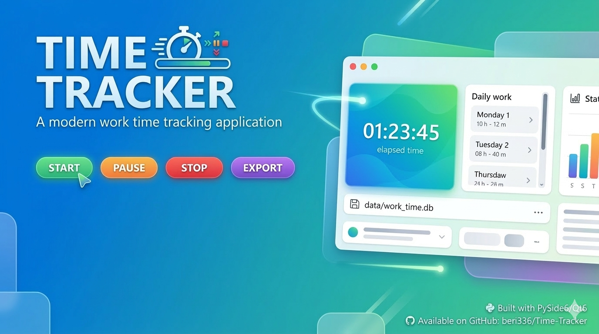
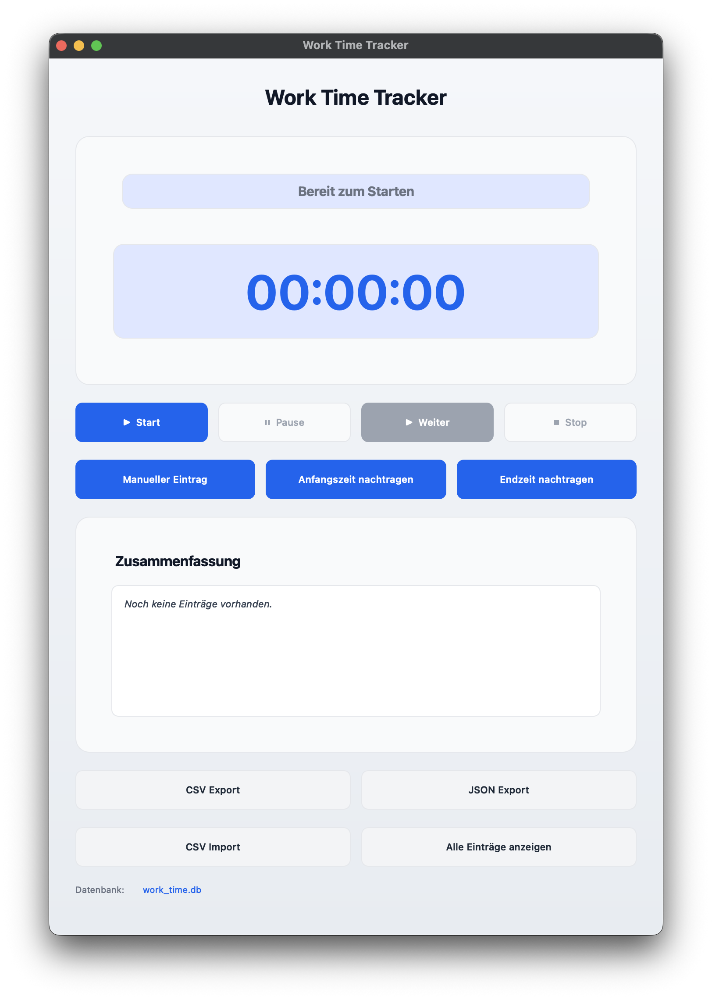

# Work Time Tracker

<div align="center">


**Modern desktop application for precise work time tracking**

</div>



<div align="center">

[Features](#features) • [Installation](#installation) • [Usage](#usage) • [Database](#database) • [Code Structure](#code-structure) • [Me](#me) • [License](#license)

</div>

<br>

## Motivation

The **Work Time Tracker** was created to solve the challenge of accurately tracking work hours with a professional, intuitive interface. Originally developed for personal use during thesis work, it has evolved into a complete time tracking solution that provides:

- Precise session tracking with pause/resume functionality
- Permanent data storage in SQLite database
- Multiple input methods (live timer, manual entry, retroactive start/end times)
- Professional data export (CSV, JSON) for analysis
- Comprehensive statistics (daily, weekly, monthly overviews)
- Clean, modern UI with consistent design system

<hr>

## Installation

### Prerequisites
- **Python** 3.10+ ([Download](https://www.python.org))
- **PySide6** 6.6+ 

### Quick Start
```bash
pip3 install pyside6
python3 main.py
```

### From Source
```bash
git clone https://github.com/beri336/Time-Tracker
cd time-tracker
pip3 install pyside6
python3 main.py
```

<hr>

## Usage

### Main Interface



### Core Workflow
1. **Click "Start"** -> Timer begins counting up
2. **"Pause"** -> Timer stops, elapsed time preserved
3. **"Continue"** -> Timer resumes from paused time
4. **"Stop"** -> Session saved to database automatically
5. **Summary updates** -> Daily totals refresh instantly

### Advanced Features

| Feature | Description |
|---------|-------------|
| **Manual Entry** | Complete dialog for date/time/pause input with auto-duration calculation |
| **Retro Start** | Set start time in past → timer shows correct elapsed time |
| **Retro End** | Set end time for running session → auto-save with validation |
| **All Entries** | Table view with delete function, sortable columns |
| **Statistics** | Weekly/monthly summaries with total hours per period |

<hr>

## Features

### Time Tracking
- Live timer with start/pause/continue/stop controls
- Retroactive start/end time entry for forgotten sessions
- Manual entry dialog with pause duration calculation
- Status indicators (Running/Paused/Ready)

### Data Management
```
work_time table:
├── id (PK, autoincrement)
├── date (dd.MM.yyyy)
├── start_time (HH:mm:ss)  
├── end_time (HH:mm:ss)
└── duration (HH:mm:ss, net work time)
```
- SQLite database (single file, portable)
- Create new empty database

### Export/Import
- **CSV**: Compatible with Excel/Google Sheets
- **JSON**: Structured data with metadata
- Multi-language CSV headers supported

### Analysis
- Live daily summary dashboard
- Weekly overview (KW01, KW02...)
- Monthly overview (MM.YYYY format)
- Session counts and total hours per period

### UI/UX
- Modern gradient design system
- Responsive layouts
- Professional dialog designs
- HTML-formatted summary display

<hr>

## Database

**Schema:**
```sql
CREATE TABLE work_time (
    id INTEGER PRIMARY KEY AUTOINCREMENT,
    date TEXT NOT NULL,        -- '11.03.2026'
    start_time TEXT NOT NULL,  -- '09:15:23' 
    end_time TEXT NOT NULL,    -- '17:45:38'
    duration TEXT NOT NULL     -- '08:12:45'
);
```

**Location:** `work_time.db` in application directory (changeable)

**Sample Query:**
```sql
SELECT date, COUNT(*), SUM(strftime('%s', duration)) as total_seconds
FROM work_time 
GROUP BY date 
ORDER BY date DESC;
```

<hr>

## Code Structure

### Key Components (500+ LOC)

| Module | Responsibilities |
|--------|------------------|
| **`WorkTimeTracker`** | Main window, orchestrates all functionality |
| **`Configs`** | Centralized labels, dimensions, menu texts |
| **`ButtonStyle`** | Design system for consistent button appearance |
| **`ModernButton`** | Custom QPushButton |

### Core Methods

```py
# Timer Control
start_timer()           # Begins session
pause_timer()           # Pauses with elapsed time preservation  
continue_timer()        # Resumes from pause
stop_timer()            # Saves and resets

# Data Operations  
init_database()         # Creates SQLite table
save_time()             # INSERT session to DB
update_summary()        # Refreshes HTML dashboard
export_to_csv()         # Full data export
import_from_csv()       # Error-tolerant import

# UI Builders
_create_header()        # Title bar
_create_timer_card()    # Main timer display
_create_summary_card()  # Daily statistics
_setup_menu()           # Complete menu system
```

### Architecture Highlights
- **MVC pattern** - Clean separation of UI/logic/data
- **Centralized styling** via helper methods

<hr>

## Me

[](https://github.com/beri336)

[](https://bitbucket.org/berkants/workspace/projects/DEV)

<hr>

## License

This project is licensed under the **MIT License** - see the [LICENSE](LICENSE) file for details.

<div align="center">

**Built with PySide6 • Cross-platform**

[⬆ Back to Top](#work-time-tracker)

</div>