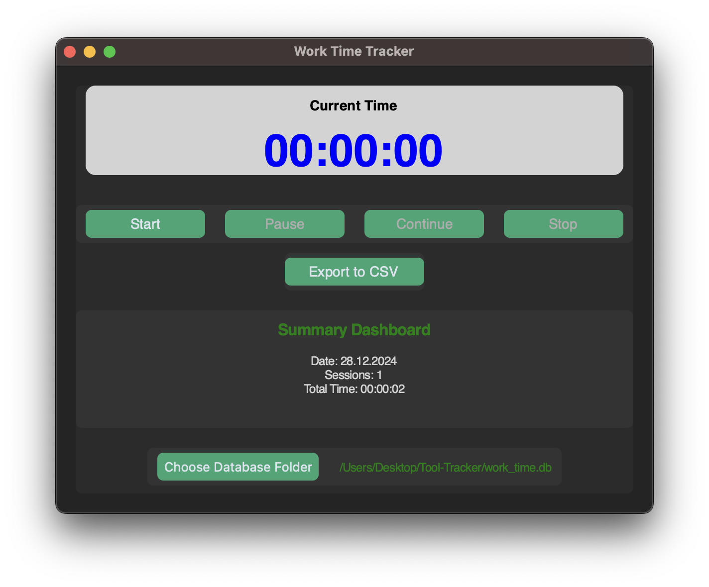

# Time Tracker

<div align="center">


**A modern, intuitive work time tracking application with beautiful UI**

[Features](#5-features) • [Installation](#installation) • [Usage](#3-usage) • [Troubleshooting](#6-troubleshooting) • [Contributing](#7-contributing)

</div>

<br><hr>

## Motivation

The **Time Tracker** tool was developed to quickly and efficiently record work hours independently. As part of my bachelor's thesis, I wanted to track my own working hours and created this small tool. It allows users to:  
- Start tracking time with an intuitive modern interface
- Take breaks and resume work after breaks
- Finish the day and save the session in a database
- Export the work data for further analysis
- Get reminders to take breaks during long sessions
- Enjoy a modern, visually appealing UI with smooth animations

<br><hr>

## Installation

### Prerequisites
- **Git** 2.30+ ([Download](https://git-scm.com))
- **Python** 3.9+ ([Download](https://www.python.org))

### Steps
1. **Clone this repository**:  
```
git clone https://github.com/beri336/Time-Tracker
```

2. **Navigate to the directory**:  
```
cd Time-Tracker
```

3. **Install dependencies**:  
```
pip3 install PySide6
```  

Alternatively, use `requirements.txt`:  
```
pip3 install -r requirements.txt
```

### Quick Start
```
python3 app.py
```

<br><hr>

## Usage

### Running the Application

```
python3 app.py
```



### Interface Components

#### Display Elements
- **Current Time Display**: Large, prominent timer with gradient background showing elapsed work time
- **Database Path**: Current database storage location (displayed at bottom)
- **Summary Dashboard**: Scrollable card with daily work summaries, session counts, and total hours

<br>

#### Control Buttons

| Button | Color | Function |
|--------|-------|----------|
| **Start** | 🟢 Green | Begins a new work session |
| **Pause** | 🟠 Orange | Pauses current session without ending it |
| **Continue** | 🔵 Blue | Resumes a paused session |
| **Stop** | 🔴 Red | Ends session and saves to database |
| **Export to CSV** | 🟣 Purple | Exports all data to CSV file |
| **Choose Database Folder** | ⚫ Gray | Changes database storage location |

<br><hr>

## 4. Code

### Architecture

The application is built using PySide6 (Qt6) with a modern component-based architecture.

#### Custom Widgets

**RoundedFrame**
- Custom `QFrame` subclass with antialiased rounded corners
- Configurable border radius (default: 12-16px)
- Supports QPainterPath for smooth rendering

**AnimatedButton**
- Enhanced `QPushButton` with hover animations
- Uses `QPropertyAnimation` for smooth scaling (105% on hover)
- Implements `QEasingCurve.OutCubic` for natural motion

### Core Functions

| Function | Description |
|----------|-------------|
| `setup_ui()` | Initializes and arranges all UI components with modern styling |
| `apply_styles()` | Applies comprehensive QSS stylesheet for design system |
| `init_database()` | Creates SQLite database structure and folder |
| `start_timer()` | Starts timer and records session start time |
| `pause_timer()` | Pauses timer while retaining elapsed time |
| `continue_timer()` | Resumes paused timer from last state |
| `stop_timer()` | Stops timer, saves to database, and resets |
| `reset_timer()` | Resets timer and elapsed time to zero |
| `update_clock()` | Real-time clock update using QTimer (1s interval) |
| `send_reminder()` | Displays QMessageBox break reminder |
| `save_time()` | Persists session data to SQLite database |
| `change_database_folder()` | Opens QFileDialog for folder selection |
| `export_to_csv()` | Exports session data via QFileDialog |
| `update_summary()` | Refreshes dashboard with HTML-formatted content |
| `format_path()` | Truncates long paths for display |
| `main()` | Application entry point with QApplication |

<br><hr>

## 5. Features

### Core Functionality
- ⏱️ Precise time tracking with start, pause, continue, and stop controls
- 💾 Automatic session persistence to SQLite database
- 📊 Interactive summary dashboard with daily statistics
- 📁 Flexible database location management
- 📄 CSV export for external analysis and reporting
- 🔔 Configurable break reminders (default: 1 hour)

### Modern UI/UX
- 🎨 Gradient-based design with smooth color transitions
- ⭕ Rounded corners (12-16px) on all cards and buttons
- ✨ Smooth hover animations with 105% scaling
- 🎯 Color-coded buttons for intuitive operation
- 📱 Responsive layout adapting to window size
- 🖋️ Professional Segoe UI typography
- 📜 Custom-styled scrollbars
- 💳 Card-based design system with clear hierarchy

### Technical Highlights
- Built with PySide6/Qt6 framework
- Custom widget implementation (RoundedFrame, AnimatedButton)
- QPropertyAnimation for smooth transitions
- Comprehensive QSS styling system
- Cross-platform compatibility (Windows, macOS, Linux)
- Antialiased rendering for crisp visuals

<br><hr>

## 6. Troubleshooting

### Installation Issues

**PySide6 Installation Fails**
```
# Upgrade pip first
pip3 install --upgrade pip3

# Try specific version
pip3 install PySide6==6.6.0

# Use pip3 on some systems
pip3 install PySide6
```

### Display Issues

**UI Looks Distorted or Blurry**
- Enable high-DPI scaling: Set `QT_AUTO_SCREEN_SCALE_FACTOR=1`
- Check system scaling settings (Windows: 100-150% recommended)

### Database Issues

**Cannot Save Sessions**
- Verify write permissions for database folder
- Check available disk space
- Ensure folder path doesn't contain special characters

**Data Not Appearing**
- Confirm session was stopped (not just paused)
- Check Summary Dashboard scrollbar for overflow
- Open `work_time.db` with SQLite browser to verify data

<br><hr>

## 7. Contributing

<div align="center">


<br><hr>

## 8. License

This project is licensed under the **MIT License**. See the [LICENSE](LICENSE) file for details.

<br><hr>

## 9. Version

### Version 2.0.0 (Current)
**Release Date**: December 2024

**Major Changes:**
- Complete UI redesign with PySide6/Qt6 framework
- Modern gradient-based design system
- Custom widget implementation (RoundedFrame, AnimatedButton)
- Smooth button hover animations with QPropertyAnimation
- Enhanced Summary Dashboard with HTML formatting
- Improved typography with Segoe UI font family
- Comprehensive QSS styling
- Better responsive layout and spacing
- Color-coded buttons for intuitive UX
- Cross-platform compatibility improvements

**Breaking Changes:**
- Migration from CustomTkinter to PySide6
- Different dependency requirements

---

### Version 1.0.0
**Release Date**: Initial Release

**Features:**
- Core time tracking functionality
- Basic CustomTkinter UI
- SQLite database integration
- CSV export capability
- Break reminders
- Simple interface

---

<div align="center">

**Made with ❤️ and Python**

[⬆ Back to Top](#time-tracker)

</div>
